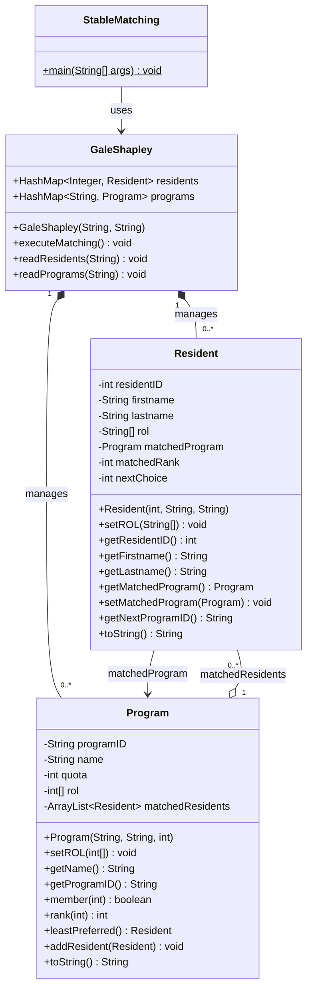

```mermaid
classDiagram
    class StableMatching {
        +main(String[] args)$ void
    }

    class GaleShapley {
        +HashMap~Integer, Resident~ residents
        +HashMap~String, Program~ programs
        +GaleShapley(String, String)
        +executeMatching() void
        +readResidents(String) void
        +readPrograms(String) void
    }

    class Resident {
        -int residentID
        -String firstname
        -String lastname
        -String[] rol
        -Program matchedProgram
        -int matchedRank
        -int nextChoice
        +Resident(int, String, String)
        +setROL(String[]) void
        +getResidentID() int
        +getFirstname() String
        +getLastname() String
        +getMatchedProgram() Program
        +setMatchedProgram(Program) void
        +getNextProgramID() String
        +toString() String
    }

    class Program {
        -String programID
        -String name
        -int quota
        -int[] rol
        -ArrayList~Resident~ matchedResidents
        +Program(String, String, int)
        +setROL(int[]) void
        +getName() String
        +getProgramID() String
        +member(int) boolean
        +rank(int) int
        +leastPreferred() Resident
        +addResident(Resident) void
        +toString() String
    }

    StableMatching --> GaleShapley : uses
    GaleShapley "1" *-- "0..*" Resident : manages
    GaleShapley "1" *-- "0..*" Program : manages
    Resident --> Program : matchedProgram
    Program "1" o-- "0..*" Resident : matchedResidents
```
